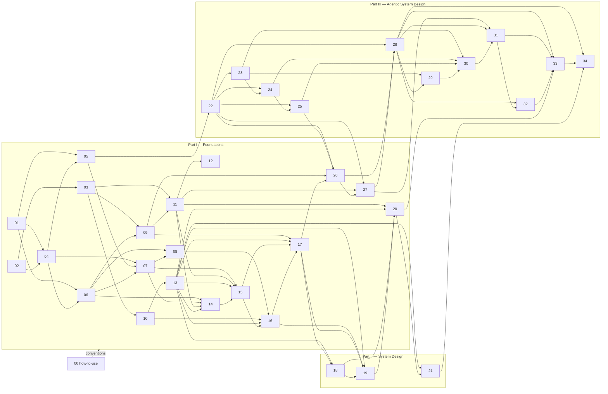

# Course map — FINALIZED dependency DAG (Phase 2)

The headline is **System Design + Agentic System Design**. Everything else is a foundation
sub-course (00–12) the headline draws on, or a deep reference appendix (A–O) that sub-courses
cross-link into. Two-tier by design: **spine** teaches transferable CONCEPTS + build labs;
**appendices** go infinitely deep on a REAL SYSTEM, info-only (no exercises — CONSTITUTION #5).

Per-chapter 3–5-line specs, paired build lab, diagrams-needed, and sources/gaps live in each unit's
`<unit>/_structure.md` (the Phase-2 deliverable). This file is the **map + the DAG**; the structure
files are the territory.

---

## Part 0 — Orientation
- **00** how-to-use-this-course   (agent-paired learning prompts; the map; how to read this)

## Part I — Foundations (spine; concepts + build labs where they fit)
- **01** computers-from-first-principles      (0s/1s → gates → ALU → CPU → ISA)
- **02** terminal-shell-and-dev-environment   (shell, processes, pipes) [lab: own shell]
- **03** networking-from-first-principles     (links → IP → TCP → TLS → HTTP) [lab: own TCP/IP]
- **04** operating-systems-internals          (processes, memory, scheduling, fs, syscalls)
- **05** programming-language-runtime-internals (parsing, bytecode, VMs, GC, JIT — generic)
- **06** data-structures-for-systems          (B-trees, LSM, bloom, skiplist, ring buffer, HLL, consistent hashing)
- **07** database-internals                   (storage, indexes, query exec, txns) [lab: own DB]
- **08** caches-and-storage-systems           (cache strategies, eviction, write paths)
- **09** message-queues-logs-and-kafka        (the log abstraction, partitions, delivery) [lab: own MQ]
- **10** nginx-proxies-and-load-balancing     (reverse proxy, LB algos, event-driven servers) [lab: own HTTP server/LB]
- **11** distributed-systems-foundations      (time, replication, consensus, CAP, partitioning)
- **12** research-papers-for-engineers        (how to read a paper + walkthroughs of the canon)

## Part II — System Design (headline 1; concepts + design case studies as labs)
- **13** scaling-fundamentals                 (latency numbers, back-of-envelope, bottlenecks)
- **14** data-modeling-partitioning-sharding
- **15** replication-and-consistency-in-practice
- **16** caching-and-cdn-strategies
- **17** async-queues-and-event-driven-architecture
- **18** rate-limiting-backpressure-and-load-shedding   (SEDA)
- **19** observability-tracing-and-slos                 (Dapper)
- **20** resilience-failure-and-capacity-planning        (The Tail at Scale)
- **21** design-case-studies                            (URL shortener, feed, chat, search, payments, rate limiter) — Part II capstone

## Part III — Agentic System Design (headline 2; concepts + harness build track)
- **22** the-agent-loop                       (call → observe → decide → repeat)
- **23** tools-and-tool-contracts
- **24** prompts-and-context-engineering
- **25** memory-short-term-long-term-and-safety
- **26** state-persistence-and-resume
- **27** planning-and-multi-agent-orchestration  (supervisor, fan-out, teams, dynamic workflows)
- **28** build-your-own-coding-harness          [lab: capstone harness — loop→tools→memory→subagents→budgets→compaction]
- **29** mcp-skills-and-connectors
- **30** rag-retrieval-and-grounding
- **31** evaluation-tracing-and-guardrails
- **32** cost-observability-and-ops
- **33** safety-and-proactive-self-evolving-agents
- **34** design-your-own-agentic-system         (Part III capstone design canvas)

## Appendices (A–O; reference-grade DEEP info only, NO exercises)
- **A** computer-architecture   · **B** linux-internals · **C** python-internals ·
  **D** javascript-v8-nodejs-internals · **E** java-jvm-internals · **F** postgres-internals ·
  **G** redis-internals · **H** kafka-internals · **I** docker-containers-cgroups-namespaces ·
  **J** kubernetes-internals · **K** compilers-interpreters-and-jit ·
  **L** consensus-replication-and-transactions · **M** ai-agent-memory-tools-and-evaluation ·
  **N** math-for-systems · **O** cloud-infra-basics

> **Scope note (ADR-003):** appendices are reference-only and intentionally have NO `_structure.md`.
> Their bespoke shape already lives in each `<appendix>/_research.md` (e.g. F = "life of a row",
> I = "there is no container", K = "3-stage+JIT pipeline"). Phase-2 structures cover the 35 spine
> units (00–34) only. Candidate appendices P/Q/R remain proposals; add only via an ADR.

---

## The dependency DAG (finalized Phase 2)

Edges are **primary** prerequisites (what you must have internalized first). "Light" / preview
dependencies are noted in each `_structure.md` but omitted here to keep the critical DAG legible.
The graph is acyclic; the 31↔18/19 "feedback loop" is a runtime control loop, not a build-order cycle
(sensing 19 → actuating 18 → 31 wraps both), so it carries a single build-order edge 18/19 → 31.

### Adjacency list (unit → units it directly unlocks)

```
00 → (sets conventions for ALL units)
01 → 04, 05, 06, A
02 → 03, 04
03 → 09, 10, 11, 18
04 → 05, 06, 07, B
05 → 07, 22, 24, K
06 → 07, 08, 09, 14, 30, N
07 → 08, 14, 15, F
08 → 16, 25, 30, G
09 → 11, 17, 26, H
10 → 13, 16, 18
11 → 12, 14, 15, 20, 27, L
12 → (canon feeds ALL of Part II/III)
13 → 14, 15, 16, 17, 18, 19, 20, 21      (the quantitative spine of Part II)
14 → 15, 21
15 → 16, 17, 21
16 → 17, 19, 21
17 → 18, 19, 26, 21
18 → 19, 20, 31
19 → 20, 31, 32
20 → 21, 32, 33
21 → (Part II capstone; design method feeds Part III)
22 → 23, 24, 25, 26, 27, 28, 32   (the loop every Part III unit refines)
23 → 24, 29, 30, 33
24 → 25, 30, 32
25 → 26, 30, 33
26 → 27, 28, 33
27 → 28, 31, 34
28 → 29, 31, 32, 33, 34            (Part III capstone LAB)
29 → 30, 31, 32, 33
30 → 31, 32, 33, 34
31 → 32, 33, 34
32 → 33, 34
33 → 34
34 → (terminal spine chapter; feeds the LEARNER)

Appendix back-edges (spine cross-links DOWN):
A ← 01      B ← 04      C ← 05/K    D ← 05/K    E ← 05/K
F ← 07      G ← 08      H ← 09      I ← B/04    J ← I/11
K ← 05      L ← 11      M ← 22-33   N ← 06/13   O ← 13/15/20/I/J
```

### Mermaid (spine build-order DAG)



### Recommended reading orders
- **Linear (cover-to-cover):** 00 → 01 → 02 → 03 → 04 → 05 → 06 → 07 → 08 → 09 → 10 → 11 → 12 →
  13 → 14 → 15 → 16 → 17 → 18 → 19 → 20 → 21 → 22 → 23 → 24 → 25 → 26 → 27 → 28 → 29 → 30 → 31 →
  32 → 33 → 34. (The number line IS a valid topological sort — verified against the adjacency list.)
- **"I only want System Design":** 00 → 01,03,04,06 (skim) → 11 → 13 → 14–21.
- **"I only want Agentic System Design":** 00 → (assume 04/09/13/17/18/19/20 fluency) → 22 → 23 →
  24 → 25 → 26 → 27 → 28 → 29 → 30 → 31 → 32 → 33 → 34. 22 explicitly bridges from the foundations.
- **Appendices** are pulled in on demand from spine cross-links — never read front-to-back.

---

## Build labs index (/build; spine references these)
| lab | grown by | from → to |
|-----|----------|-----------|
| own-shell | 02 | parse → fork/exec/wait → pipes → job control |
| own-tcp-ip-stack | 03 | link → IP → TCP state machine → (TLS/HTTP) |
| own-database | 07 | pages → B+tree → WAL → MVCC → query exec |
| own-redis | 08 (+ App G) | event loop → encodings → eviction → persistence |
| own-http-server-and-load-balancer | 10 | epoll loop → HTTP/1.1 → reverse proxy → LB algos |
| own-message-queue | 09 | segment log → offsets → consumer groups → delivery |
| own-interpreter/compiler | 05 (+ App K) | lexer → parser → bytecode → VM → (JIT) |
| **own-coding-agent-harness (capstone)** | **22→34** | loop → tools → context → memory → persistence → orchestration → connectors → grounding → trust → cost → safety |

The agentic capstone harness is grown across Part III as ELEVEN stacked upgrades (one per unit
22–33), each motivated by the previous stage's observed wall (see 28's `_structure.md`). 34 wraps the
whole thing in a design canvas + budget calculator.

---

## Per-chapter specs
Every unit's chapter-by-chapter breakdown (3–5 lines each), paired build lab, diagrams-needed list,
and sources/gaps (with all `[UNVERIFIED]` flags preserved verbatim) live in `<unit>/_structure.md`.
PROGRESS.md tracks state + section count per unit.
